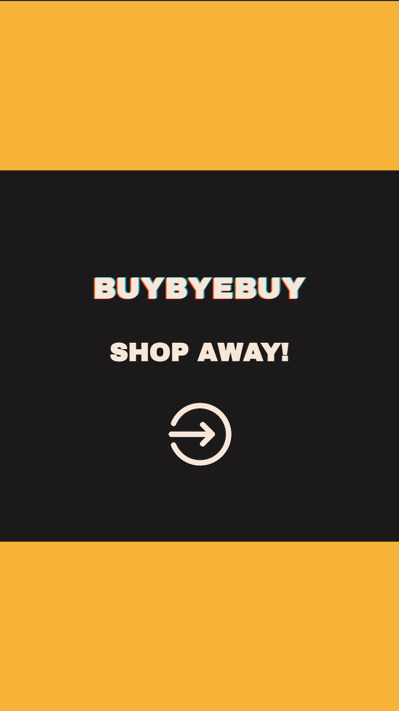
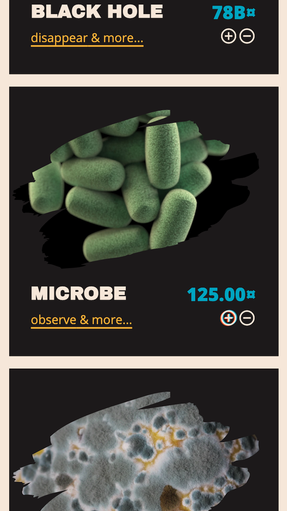
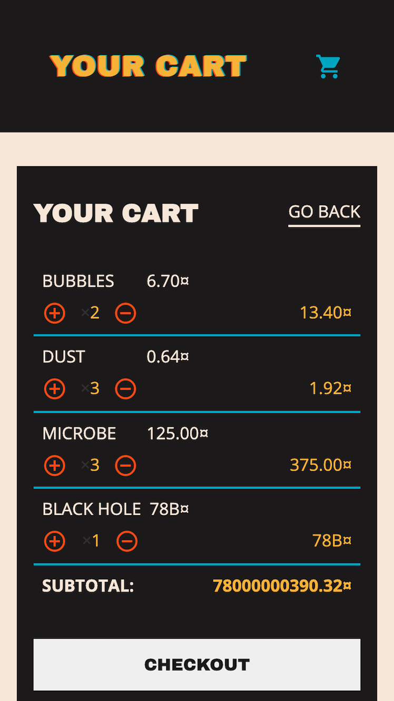
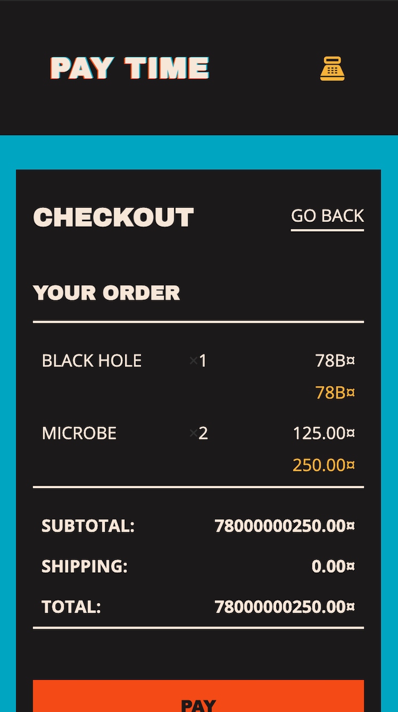
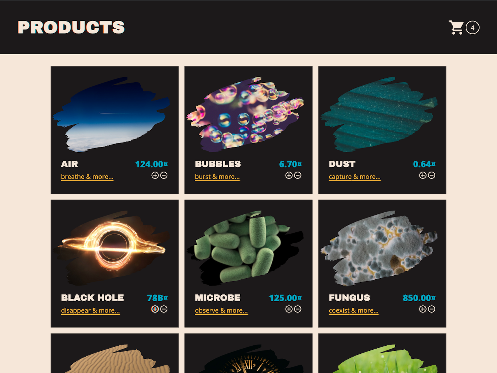
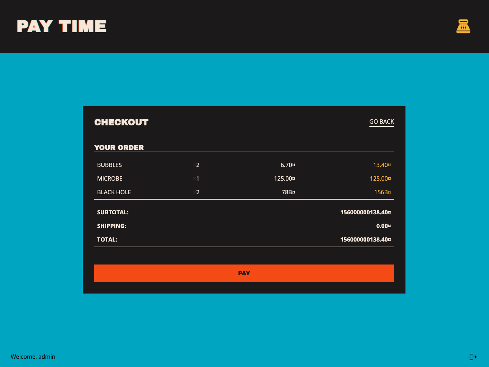

# BuyByeBuy — an online shop simulation

A frontend-only webshop simulation. [Shop away here](https://buybyebuy.vercel.app/). Have fun!

## Tech & tools

- React (Hooks API)
- Context API
- React Router
- Styled Components
- Material design icons
- Google Sheets (data storage)
- Canva (design & prototyping)

This project was bootstrapped with [Create React App](https://github.com/facebook/create-react-app).

## Look & Feel

### Mobile screenshots

### Tablet/Desktop screenshots

## Challenges

To display the data on the 'Products' page, I created a Google Sheet and turned it into a JSON endpoint, which I then used to fetch the data. In my shop simulation, I am storing the fetched products in the app's Context.

Designing the app was another tricky part, especially styling the components in a modular way. At first I used plain CSS, which was not the best decision. Therefore, I organized my styles in a much neater way with Styled Components, even though refactoring took some time.

## Running the app locally

Clone the repository and run `npm install` in the project directory to install the dependencies.

`npm run start` — runs the app in the development mode at `http://localhost:3000`.

`npm run build` — builds the app for production to the build folder. It correctly bundles React in production mode and optimizes the build for the best performance.

You can learn more in the [Create React App documentation](https://facebook.github.io/create-react-app/docs/getting-started).
